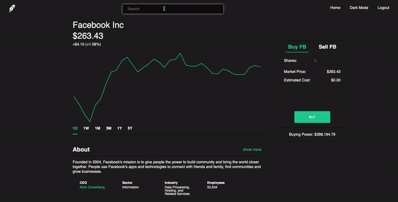

# Cache Out

Cache Out is my own rendition of the popular securities trading app Robinhood. New users can start with up to $10 million in cash, buy or sell shares of over 8,000 companies and various securities, make informed decisions with interactive company graphs and metrics and track their portfolio's performance overtime with up to the minute market data.

Here's a link to the [live site](https://cache-out.herokuapp.com/#/)

## Features
* Secure frontend to backend user authentication using the gem BCrypt
* Real-time and historical price data of all stocks traded on the NASDAQ and NYSE exchanges
* Interactive charts displaying a stock's price fluctuation as well as the user's portfolio balance fluctuation over time
* Ability to simulate real stock-market trades by buying and selling shares at the most recent market price
* Ability to search stocks by both their ticker symbol and Company name
* Relevant news displayed for the general market on home page, and for specific stock on the stock's show page

## Portfolio Page
Once a User logs in, they are directed to the portfolio page, which displays a chart showing their portfolio valuation over time, a list of their holdings with the current day fluctuation, and real-time financial news
<br/>
<br/>

<br/>
<br/>
#### Portfolio Snapshots (**newest feature**)
In order to render charts that display a user's portfolio balance over time, 'snapshots' of the users portfolio balance are calculated and then saved using rake tasks and Heroku Scheduler. Through a simple association between the `User` and `PortfolioSnapshot` models, all of the user's historical portfolio data can easily be fetched.

```rb
# 'snapshot'
namespace :scheduler do
  task :add_portfolio_snapshots_for_day => :environment do
    puts "Adding day's portfolio snapshots..."
    require 'date'
    require 'us_bank_holidays'

    today = Date.today
    next if today.weekend?
    next if today.bank_holiday?
  
    time = Time.now
    timeString = time.to_s
    timeArr = timeString.split(" ")[1]
    hour = timeArr.split(":")[0]
    min = timeArr.split(":")[1]
    next if hour.to_i < 13
    next if hour.to_i > 19

    
    users = User.all
    users.each do |user| 
      balance = user.calculate_total_assets
      PortfolioSnapshot.create({ valuation: balance, user_id: user.id })
    end
    
    puts "done."
  end
end
```
```rb
  def calculate_total_assets
    assets = []
    return buying_power if holdings.empty?

    holdings.each do |holding| 
      url = "https://financialmodelingprep.com/api/v3/stock/real-time-price/#{holding.ticker}"
      security = JSON.parse(open(url).read)
      assets << security['price'] * holding.quantity
    end

    assets.sum + buying_power
  end
```
### Show Page
An Security show page contains current and historical price information data, general company information, relevant news, and allows users to purchase and sell shares of the stock at the most recent market price. 

#### Fetching Security Data

Upon visiting a show page, a variety of API calls are made to fetch the necessary information to render the price charts, the information ('About' section) and relecant news articles. The following APIs are hit
* [Financial Modeling Prep](https://financialmodelingprep.com/) - 4 separate API calls
  * Company Profile (symbol, company name, CEO, industry, etc.)
  * Real Time asset price which continually updates
  * Intraday Price Data (5 minutes historical prices with volume)
* [News API](https://newsapi.org/) - 1 API call

#### Dynamic Chart Rendering
Charts are dynamic and interactive, allowing users to switch between ranges of **1D**, **1W**, **1M**, **3M**, **1Y**, and **5Y** for individual stocks or their overall portfolio. Buttons for each range appear below the chart with click handlers installed, which serve to update the React component's local state with the relevant chunk of data. The `handleFetch` function takes in a range and determines which thunk actions to trigger to fetch the desired data. 

```js
    handleFetch(time) {
        switch (time) {
            case "1d":
                this.props.receiveDay(`${this.props.ticker}`);
                break;
            case "1w":
                this.props.receiveWeek(`${this.props.ticker}`);
                break;
            case "1m":
                this.props.receiveHistorical(`${this.props.ticker}`);
                break;
            case "3m":
                this.props.receiveHistorical(`${this.props.ticker}`);
                break;
            case "1y":
                this.props.receiveHistorical(`${this.props.ticker}`);
                break;
            case "5y":
                this.props.receiveHistorical(`${this.props.ticker}`);
                break;
        }
    }
```

Aside from this minimizing the data returned from expensive external API calls, this switch method helps organize the applications Redux state into a single "graphPrices" slice. If other front end developers were to work on this app with me, it would be very easy to navigate.

### Transaction Validation

No Cheating for my users! Users are only allowed to purchase shares of stock if they have adequate buying power. Additionally, they are only allowed to sell, at max, as many shares as they own. 
<br/>
<br/>
 
<br/>
<br/>
These checks are handled by the holdings controller on the back-end, and descriptive error messages will be rendered to the page if a user attempts to make an invalid transaction. The form will only submit and trigger a refresh of the page upon a valid transaction submitted by the user.

```rb
    def create
        if params[:holding][:buying_power].to_f >= 0
            @user_records = Holding.where(user_id: params[:holding][:user_id])
            @update_record = @user_records.find_by(ticker: params[:holding][:ticker])
            if @update_record
                new_amt = @update_record.quantity + params[:holding][:quantity].to_i
                if new_amt > 0
                    @update_record.update(quantity: new_amt)
                    @holding = @update_record
                    render :show
                elsif new_amt == 0
                    @update_record.destroy
                else
                    render json: ["not enough shares"], status: 422
                end
            else
                @holding = Holding.new(holdings_params)
                if @holding.quantity >= 0
                    @holding.save
                    render :show
                else
                    render json: ["not enough shares"], status: 422
                end
            end
        end
    end
```

### Search

Users can search for over 8,000 companies and other various securities to purchase across multiple exchanges. Because the navigation element getes reused, this fetch is performed just once when the user signs in. The suggestion logic performed when typing makes sure that exact matches appear at the top.
<br/>
<br/>

<br/>
<br/>
Users may type in any word or symbol in the companies name and, if specific enough, it will populate in the suggestions box. 

### Technologies and Libraries
* Backend: Rails/ActiveRecord/PostgreSQL
* Frontend: React/Redux
* [Financial Modeling Prep API](https://financialmodelingprep.com/)
* [News API](https://newsapi.org/)
* [Recharts](http://recharts.org/en-US/)
* [CSS Animate](http://animate.css)
* [MomentJS](https://momentjs.com/)
* [NumeralJS](http://numeraljs.com/)
